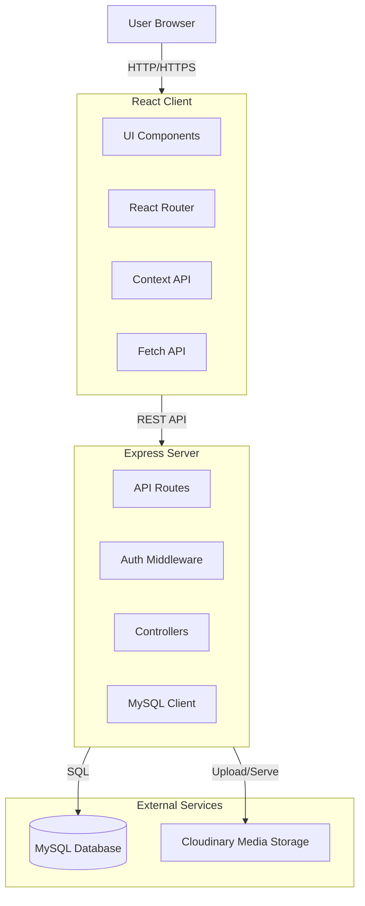

# Gravity2 - Technical Specification

## 1. Project Overview
**Gravity2** (branded as **QaraOke**) is a web-based application designed to help users create, edit, and share karaoke-style lyric animations synchronized with audio. It features a robust editor for timing and styling lyrics, a social platform for sharing projects, and a user management system.

## 2. Architecture
The project follows a **Monolithic Client-Server Architecture** where the frontend and backend are contained within the same repository but run as separate processes during development.



## 3. Technology Stack

### Frontend
-   **Framework**: React 19
-   **Build Tool**: Vite 7
-   **Routing**: React Router DOM 7
-   **Styling**: CSS Modules / Global CSS
-   **Icons**: React Icons
-   **State Management**: React Context API (`LanguageContext`)

### Backend
-   **Runtime**: Node.js
-   **Framework**: Express 5
-   **Database Driver**: MySQL2 (Promise-based)
-   **Authentication**: JSON Web Tokens (JWT) + Bcrypt
-   **File Uploads**: Multer + Multer Storage Cloudinary
-   **Environment Management**: Dotenv

### Database
-   **System**: MySQL
-   **Hosting**: (Configurable via `.env`, typically local or cloud-hosted like PlanetScale/Railway)

### External Services
-   **Cloudinary**: Used for storing user avatars, project preview images, and audio files.

## 4. Directory Structure

```
Gravity2/
├── server/                 # Backend Source Code
│   ├── config/             # Configuration files
│   ├── controllers/        # Route logic (if separated)
│   ├── middleware/         # Auth & Error handling
│   ├── routes/             # API Route definitions
│   ├── uploads/            # Temp upload storage
│   ├── db.js               # Database connection setup
│   ├── index.js            # Server entry point & API implementation
│   └── schema.sql          # Database schema definitions
├── src/                    # Frontend Source Code
│   ├── assets/             # Static assets
│   ├── components/         # Reusable UI components
│   ├── context/            # Global state (Language)
│   ├── pages/              # Page components (Views)
│   ├── App.jsx             # Main App component & Routing
│   ├── main.jsx            # Entry point
│   ├── translations.js     # i18n dictionaries (EN, RU, KK)
│   └── config.js           # Frontend configuration
├── public/                 # Public static files
├── .env                    # Environment variables
├── package.json            # Project dependencies & scripts
└── vite.config.js          # Vite configuration
```

## 5. Database Schema

The application uses a relational database with the following key tables:

-   **`users`**: Stores user credentials and profile info.
    -   `id`, `username`, `password_hash`, `nickname`, `avatar_url`, `is_admin`, `language`, `created_at`.
-   **`projects`**: Stores lyric animation projects.
    -   `id`, `user_id`, `name`, `data` (JSON: lyrics, timing, styles), `is_public`, `preview_url`, `preview_urls` (JSON), `audio_url`, `timestamps`.
-   **`comments`**: Stores comments on projects.
    -   `id`, `project_id`, `user_id`, `content`, `parent_id` (for threading), `is_pinned`, `timestamps`.
-   **`likes`**: Stores project likes.
    -   `user_id`, `project_id`.
-   **`followers`**: Stores user follow relationships.
    -   `follower_id`, `following_id`.
-   **`notifications`**: Stores user notifications.
    -   `user_id`, `type`, `source_id`, `trigger_user_id`.
-   **`comment_likes`**: Stores likes on comments.

## 6. Key Features

### 6.1. Lyric Editor
-   **Audio Upload**: Support for MP3 files via Cloudinary.
-   **Lyric Input**: Manual text entry for lyrics.
-   **Timing Sync**: Tools to synchronize lyrics with audio playback.
-   **Styling**: Customization of fonts, colors, and backgrounds.
-   **Preview Management**: Upload up to 3 preview images for the project card.

### 6.2. Social Platform
-   **Feed**: "For You" page displaying public projects.
-   **Following**: Feed of projects from followed creators.
-   **Interactions**: Like projects, comment (threaded), and follow users.
-   **Notifications**: Alerts for likes, comments, and follows.

### 6.3. User Management
-   **Authentication**: Secure Register/Login with JWT.
-   **Profile**: Customizable nickname, avatar, and password.
-   **Dashboard**: Manage personal projects (Edit/Delete/Visibility).
-   **Admin Dashboard**: Special access for admins to manage all users and projects.

### 6.4. Internationalization (i18n)
-   Built-in support for **English (en)**, **Russian (ru)**, and **Kazakh (kk)**.

## 7. API Endpoints

### Authentication
-   `POST /api/auth/register`: Register a new user.
-   `POST /api/auth/login`: Authenticate and receive JWT.

### Users
-   `GET /api/users/settings`: Get current user settings.
-   `PUT /api/users/settings`: Update password/language.
-   `PUT /api/users/profile`: Update nickname/avatar.
-   `GET /api/users/:username`: Get public user profile.
-   `DELETE /api/users/:id`: Delete user account.
-   `POST /api/users/:id/follow`: Follow a user.
-   `DELETE /api/users/:id/follow`: Unfollow a user.

### Projects
-   `GET /api/projects`: Get current user's projects.
-   `POST /api/projects`: Create a new project.
-   `GET /api/projects/:id`: Get specific project details.
-   `PUT /api/projects/:id`: Update project data.
-   `DELETE /api/projects/:id`: Delete a project.
-   `GET /api/projects/public`: Get all public projects.
-   `POST /api/projects/:id/preview`: Upload project preview image.
-   `POST /api/projects/:id/audio`: Upload project audio.

## 8. Setup & Installation

1.  **Install Dependencies**:
    ```bash
    npm install
    ```
2.  **Environment Setup**:
    Create a `.env` file with:
    -   `DB_HOST`, `DB_USER`, `DB_PASSWORD`, `DB_NAME`
    -   `JWT_SECRET`
    -   `CLOUDINARY_CLOUD_NAME`, `CLOUDINARY_API_KEY`, `CLOUDINARY_API_SECRET`
3.  **Database Initialization**:
    The server automatically attempts to create tables on startup if they don't exist.
4.  **Run Development Servers**:
    -   Frontend: `npm run dev` (Vite)
    -   Backend: `npm run server` (Node)
